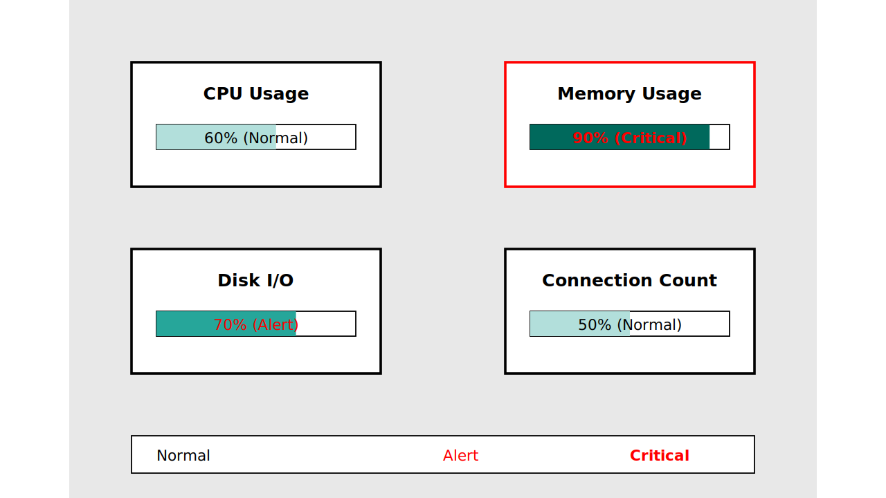
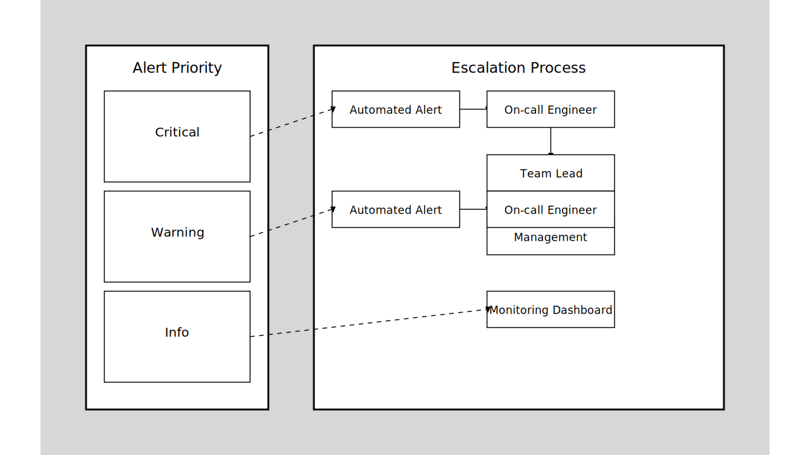

# DB モニタリング

本記事では、DB モニタリングの重要性とその基礎概念を記述している。

プロジェクトにモニタリングツール未導入の場合は参考として頂きたい。

## DB モニタリングツールの重要性

DBモニタリングツールは「**高信頼性と経済性を両立したシステム管理**」を目的としている。

言い換えれば

* DB に突然停止の予兆はなく、安全に保たれているか
* コストは適切に保たれているか

を知るための仕組みである。その為には大枠三つの役割が必要である。

| 役割                       | 目的                                                                                     |
| -------------------------- | ---------------------------------------------------------------------------------------- |
| システムの安定維持         | 潜在的な問題の早期発見と対応<br />突発的なアラート通知と対応                             |
| パフォーマンスの継続的改善 | クエリ実行時間の監視と最適化<br />リソース使用状況の把握と調整                           |
| コストの最適化             | リソース使用効率を基にした、ランニングコスト削減<br />需要予測に基づく容量移行計画の実施 |

役割を十分に発揮するために、本記事では三つに絞って話を進める。

1. モニタリングツール導入と判断材料
2. 主要メトリクスの理解
3. アラート原則の理解

## 1. モニタリングツールの導入と判断材料

モニタリングツールは、大きく分けてオープンソースと商用ツールに分類される。

プロジェクトの予算・目的・人員リソース等に応じて、何を導入するか検討されたい。

具体的なツールの使い方は割愛する。

### 導入観点

| 観点           | オープンソース                                 | 商用ツール                         |
| -------------- | ---------------------------------------------- | ---------------------------------- |
| コスト         | 低コスト(主に無料)                             | 高コスト                           |
| カスタマイズ性 | 自由度が高い                                   | 制限がある場合がある               |
| サポート       | コミュニティベースで限定的な場合あり           | 専門的なサポートあり               |
| 機能性         | 基本的な機能(場合により限定的)                 | 高度な分析機能が含まれる場合が多い |
| セットアップ   | 技術力が必要                                   | 比較的容易                         |
| 維持管理       | 技術力が必要                                   | 専門サポートあり                   |
| その他リスク   | メンテナンス終了による特定バージョンの入手遮断 | ベンダーロックインのリスクがある   |

### オープンソース

| 名称       | プロジェクト規模 | 導入難度 | 強み                     | 留意点                                                                                    |
| ---------- | ---------------- | -------- | ------------------------ | ----------------------------------------------------------------------------------------- |
| Prometheus | 小-大            | 中       | 時系列データの収集と分析 | デフォルトでは長期データ保存に制限がある<br />別途追加対策が必要                          |
| Grafana    | 小-大            | 低       | データの可視化           | データ収集には他のツールとの組み合わせが必要                                              |
| Zabbix     | 中-大            | 高       | 幅広いモニタリング機能   | 設定の複雑さと学習曲線の高さに注意が必要                                                  |
| ELK Stack  | 中-大            | 高       | 統合分析機能             | リソース要件(要求マシンスペック)が他と比べて高い<br/>スケーリングが課題になる可能性がある |


### 商用ツール

以下のような語句を用いて Web 検索を試し、予算や目的に収まるものを選定頂きたい。

* `Enterprise database monitoring tools`
* `Database health check software`
* `Real-time database analytics platforms`

## 2. 主要メトリクスの理解

モニタリングツールの導入が終わったら、日次・週次で指標を計測し、

「**何も気にしなくて良いか、すぐにシステム確認すべきか把握できる状態**」にする必要がある。

その為には、主要メトリクス(指標)への理解が必須である。



次の表は、主要メトリクス(指標)を示した表である。

| メトリクス(指標)   | システム影響                                          | 一般的な閾値                                                     |
| ------------------ | ----------------------------------------------------- | ---------------------------------------------------------------- |
| CPU 使用率         | 高使用率時: クエリ処理遅延、全体パフォーマンス低下    | 警告: 70%以上<br />危険: 90%以上                                 |
| メモリ使用量       | メモリ不足時: ディスクI/O増加、パフォーマンス大幅低下 | 警告: 80%以上<br />危険: 90%以上                                 |
| ディスク I/O       | 高I/O待ち時間: クエリ実行速度に直接影響               | 警告: 70%以上のディスク使用率<br />危険: 平均I/O待ち時間20ms以上 |
| コネクション数     | 過剰接続時: 新規接続確立の遅延                        | 警告: 最大接続数の80%以上<br />危険: 最大接続数の95%以上         |
| スロークエリの頻度 | 頻発時: システム全体のパフォーマンス低下              | 警告: 1分間に5回以上<br />危険: 1分間に20回以上                  |
| クエリ実行時間     | 長時間実行クエリ: システム全体のパフォーマンス悪化    | 警告: 1秒以上<br />危険: 10秒以上                                |

**注意1:**

閾値はあくまで一般的な目安である。実際の構成要件などに応じて見定めること

**注意2:**

「スロークエリの頻度」「クエリ実行時間」は DB 側で出力設定が必要な場合がある。

詳しくは [スロークエリ対策](../05_plan_slow_query/README.md) を参照する。

## 3. アラート設定の基本原則

常にモニタリングツールに張り付くわけにはいかない。

そこで「**特定の閾値に達したときにアラートを出す**」ようにする。



効果的なアラート設定には、次の表に記した原則への考慮が重要である。

| 原則                           | 必要な対策           | 詳細な観点                                                                                   |
| ------------------------------ | -------------------- | -------------------------------------------------------------------------------------------- |
| 優先順位付け                   | 優先度に基づく分類   | クリティカル: 即時対応必要<br />警告: 早急な注意必要だが、即時対応は不要<br />情報: 監視必要 |
| ノイズの抑制                   | 過剰アラートの回避   | 重要なアラートの見落としを防ぐ<br />アラート疲れ(オオカミ少年化)を防止                       |
| アラートへアクション可能の添付 | 詳細と対応策の提供   | アラートには事象だけでなく、詳細と推奨対応策を含める                                         |
| エスカレーション               | 段階的な対応プロセス | 「問題発生からの継続時間」と「深刻度」に応じたプロセスを決める                               |
| 継続的改善                     | 定期的な見直しと調整 | システムの変更や成熟に合わせた、アラート設定・原則全体の見直し                               |

## プロジェクト実践リスト

ここまでを踏まえた、実プロジェクトでの活用を目的としたリストである。

活用の参考として頂きたい。

```
# モニタリング設定
- [ ] モニタリングの目的と範囲を定義
- [ ] 主要なメトリクスを特定し、閾値を設定
- [ ] モニタリングツールを選定し、インストール
  - [ ] 検証環境にインストール
  - [ ] 本番環境にインストールを
- [ ] アラートルールを設定し、通知方法を決定
- [ ] ダッシュボード(概要をまとめた一覧)を作成し、重要なメトリクスを可視化
- [ ] チーム内でモニタリング方法を標準化
- [ ] 定期的なレビューと改善のプロセスを確立

# アラート設定
各種警告時のアラート設定を行う
- [ ] CPU使用率が 80% 超過
- [ ] メモリ使用率が 90% 超過
- [ ] ディスク使用率が 85% 超過
- [ ] 接続数が最大接続数の 85% 超過
- [ ] 5分間のスロークエリ数が 10 件超過
- [ ] ディスクI/O待ち時間が平均 20 ms 以上
- [ ] バックアップ失敗時のアラート設定
```

## 次のステップ

* モニタリングツール導入を判断
  * 目的決め
  * 目的に応じて、どの観点からツールを選ぶかを考慮
* モニタリングツールを導入
  * 検証環境へ導入
  * 本番環境へ導入
* 主要メトリクスを出力
* 主要メトリクスをダッシュボード(概要をまとめた一覧)に掲載
  * ダッシュボードへ日次・週次でアクセス
* 定期的にメトリクスを計測する
* アラートを設定
  * アラートの閾値決め
  * テストでアラートが通知されるようにする
