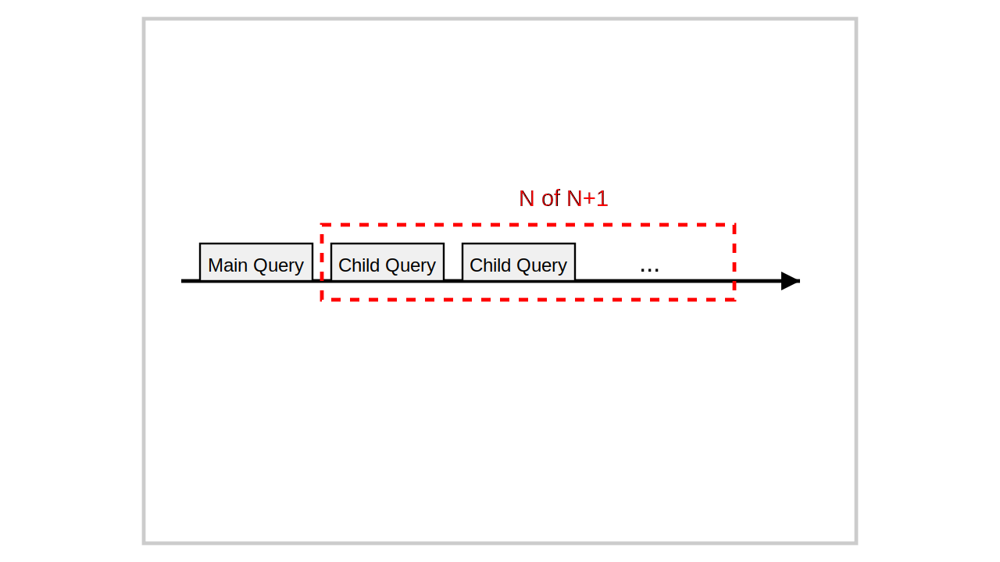

# N+1問題と対策

本記事では、ORM を扱うと発生しやすい N+1 問題とその対策を記述する。

可能な限りサンプルコードを示す。

## N+1問題とは



N+1 問題は、クエリ操作におけるパフォーマンス問題である。例えば次のような状況で発生する。

* メインクエリ発行(1回): 複数のレコード N 個を取得
* 追加クエリ発行(N回): N 個の全レコードに対し、関連データ取得のためクエリを発行する

結果として「1回のメインクエリ + N回の追加クエリ(N+1)」が実行される

次のような疑似コードで表現できる。

```
// メインのクエリ(1回)
var posts = (select * from posts limit 10)

// 各投稿に対する追加クエリ(N回)
foreach post in posts:
    var comments = (select * from comments where post_id = {post.id})
    print(comments)
```

### 影響と解決策

N+1問題は次のような **システム信頼性の低下**を引き起こす。

* 余計な処理による **DB 負荷増大**
* それに伴う **見かけ上のレスポンス遅延** あるいは **サービスの不安定化**

問題回避の為、主に次の解決手法が必要である。

| 解決手法                                                  | 難度             | 手法概要                               |
| --------------------------------------------------------- | ---------------- | -------------------------------------- |
| 事前読込<br />Eager Loading                               | 低-中            | 関連データの先行読込                   |
| データ結合によるクエリー削減<br />Query Reduction         | 低-高            | JOINを使用して複数のクエリを一つに集積 |
| IN 句の多量データ削減(チャンク処理)<br />Chunk Processing | 中-高            | 大量データをチャンク分割               |
| 前提の見直し<br />System Re-evaluate                      | (影響範囲による) | そもそも現状ママが適切かの見直し       |


以降では具体的な ORM のサンプルコードを示す。テーブルとmodelは下を参考に頂きたい。

### テーブル

```sql
create table posts (
  -- PostgreSQL
  id    SERIAL PRIMARY KEY NOT NULL
  -- MySQL
  id    BIGINT PRIMARY KEY NOT NULL AUTO_INCREMENT,

  title VARCHAR(255) NOT NULL DEFAULT ''
);

create table comments (
  -- PostgreSQL
  id      SERIAL PRIMARY KEY NOT NULL,
  -- MySQL
  id      BIGINT PRIMARY KEY NOT NULL AUTO_INCREMENT,

  body    VARCHAR(255) NOT NULL DEFAULT '',
  post_id BIGINT NOT NULL,
  FOREIGN KEY (post_id) REFERENCES posts(id)
);
```

### Prisma の model

nextjs 14.2.9 を利用

```prisma
model Post {
  id      Int @id @default(autoincrement())
  title   String @db.VarChar(255)
  Comment Comment[] @relation("PostComments")

  @@map("posts")
}

model Comment {
  id      Int @id @default(autoincrement())
  post_id Int
  body    String @db.VarChar(255)
  post    Post @relation("PostComments", fields: [post_id], references: [id])

  @@map("comments")
}
```

<details>
<summary>その他のORM モデル(クリックすると開く)</summary>

### Laravel の model

Laravel 11.0.7 を利用

```php
<?php

namespace App\Models;
use Illuminate\Database\Eloquent\Model;

class Post extends Model
{
  public function comments()
  {
    return $this->hasMany(Comment::class);
  }
}
```

```php
<?php

namespace App\Models;
use Illuminate\Database\Eloquent\Model;

class Comment extends Model
{
  public function post()
  {
    return $this->belongsTo(Blog::class);
  }
}
```

### GORM の model

* gorm - 1.25.11
* golang - 1.22.5

を利用

```go
type Post struct {
	ID       int64
	Title    string
	Comments []Comment
}

type Comment struct {
	ID     int64
	PostID int64
	Post   Post
	Body   string
}
```
</details>

## 事前読込(Eager Loading)

事前読込は、ORM が提供する **関連データを事前読込する技術** である。

過剰な事前読込は、メモリ使用量の増加(それに伴うネットワーク転送量の増加)を起こし

全体パフォーマンス低下の可能性がある。読込対象データは最小限とすること。

#### Prisma の場合

```javascript
// Before
const posts = await prisma.Post.findMany({ take: 10 });
for (const post of posts) {
  const comments = await prisma.Comment.findMany({ where: { post_id: post.id } });
  // comments を処理
}

// After
const postsWithComments = await prisma.Post.findMany({
  take: 10,
  include: {
    Comment: true
  }
});
```

<details><summary>他 ORM の例(クリックすると開く)</summary>

#### Laravel (Eloquent) の場合

```php
// Before
$posts = Post::limit(10)->get();
foreach ($posts as $post) {
    $comments = $post->comments;
    // $comments を処理
}

// After
$postsWithComments = Post::with('comments')->limit(10)->get();
```

#### GORM の場合

```go
// Before
var posts []model.Post
db.Limit(10).Find(&posts)
for _, post := range posts {
  var comments []model.Comment
  db.Where("post_id = ?", post.ID).Find(&comments)
  fmt.Println(post.Comments)
}

// After
var posts []model.Post
db.Preload("Comments").Limit(10).Find(&posts)
for _, post := range posts {
  fmt.Println(post.Comments)
}
```

</details>

## データ結合によるクエリー削減

**JOIN を使用して複数のクエリを一つにまとめる** 手法である。

過剰な JOIN は DB サーバーのメモリー圧迫に繋がる可能性があるので、

JOIN の数はできるだけ少なくする。

### Prisma の場合

```typescript
// Before
const posts = await prisma.post.findMany({ take: 10 });
for (const post of posts) {
  const comments = await prisma.comment.findMany({ where: { post_id: post.id } });
  // comments を処理
}

// After
const postsWithComments = await prisma.$queryRaw`
  SELECT *
  FROM Post p
  INNER JOIN Comment c ON p.id = c.post_id
  LIMIT 10
`;
```

<details><summary>他 ORM の例(クリックすると開く)</summary>

### Laravel (Eloquent) の場合

```php
// Before
$posts = Post::limit(10)->get();
foreach ($posts as $post) {
    $comments = $post->comments;
    // $comments を処理
}

// After
$postsWithComments =
  \DB::table('posts')
    ->join('comments', 'posts.id', '=', 'comments.post_id')
    ->select('comments.*')
    ->limit(10)
    ->get();
// comments を処理
```

### GORM の場合

```go
// Before
var posts []model.Post
db.Limit(10).Find(&posts)
for _, post := range posts {
  var comments []model.Comment
 db.Where("post_id = ?", post.ID).Find(&comments)

  // comments を処理
}

// After
var comments []model.Comment
db.Table("posts").
    Select("c.*").
    Joins("INNER JOIN comments AS c ON posts.id = c.post_id").
    Limit(10).
    Find(&comments)
// comments を処理
```

</details>

## IN句内の多量データ削減(チャンク処理)

夜間バッチや帳票出力で発生しやすい問題である。

可能な限り、**IN 句のデータは少なくするか、チャンク(かたまり)に分けて処理する**。

IN 句は与えられた値一つ一つに対し、逐次操作を行うからである。

### Prisma の例：

```javascript
// Before
const allPostIds = await prisma.post.findMany({ select: { id: true } });
const posts = await prisma.post.findMany({
  where: {
    id: { in: allPostIds.map(p => p.id) }
  }
})
// postsを処理

// After
const chunkSize = 100;
const allPostIds = await prisma.Post.findMany({ select: { id: true } });
const chunks = [];

for (let i = 0; i < allPostIds.length; i += chunkSize) {
  chunks.push(allPostIds.slice(i, i + chunkSize));
}

for (const chunk of chunks) {
  const posts = await prisma.Post.findMany({
    where: {
      id: { in: chunk.map(p => p.id) }
    },
    include: { Comment: true }
  });
  // postsを処理
}
```

<details><summary>他 ORM の例(クリックすると開く)</summary>


### Laravel (Eloquent) の場合

```php
// Before
$posts = Post::with('comments')->get();
foreach ($posts as $post) {
  // postを処理
}

// After
Post::with('comments')->chunk(100, function ($posts) {
  foreach ($posts as $post) {
    // postを処理
  }
});
```

### GORM の場合

```go
// Before
var posts []Post
db.Preload("Comments").Find(&posts)
for _, post := range posts {
  // post を処理
}

// After
const batchSize = 100
var offset = 0

for {
  var posts []model.Post
  if err := db.Preload("Comments").Offset(offset).Limit(batchSize).Find(&posts).Error; err != nil {
    panic("db error")
  }

  for _, post := range posts {
    // post を処理
  }

  if len(posts) < batchSize {
    fmt.Println("finished")
    break
  }

  offset += batchSize
}
```

</details>

## 仕組自体の見直し

ロジック含めて、仕組そのものが「負の遺産」で仕方なくツギハギしているならば

N+1対策の前に、次を今一度確認する。

* そもそも複雑怪奇な現状は正当なのか
* シンプルにできないのか
  * 見た目はそのままに、ORM 処理は変更するなど
  * まずはできるところから小さく仕組変更できないか
  * etc.

## N+1 対策後の確認

以下 2 点に留意して、最終確認をする

* (1) パフォーマンス(特に応答時間)の変化があるか
* (2) 本番環境に近いデータセットのテストに問題ないか

可能であれば、本番環境のバックアップデータをクレンジング(匿名データ化)し、

それをテスト利用するなどの対策を推奨する。

# プロジェクト実践リスト

ここまでを踏まえた、実プロジェクトでの活用を目的としたリストである。

活用の参考として頂きたい。

```
# 問題特定
* [ ] クエリ実行回数
* [ ] 長いページロード時間箇所
* [ ] 繰返しパターンのあるクエリ
* [ ] IN 句内の多量検索データ
  * いづれも DB モニターログ、もしくはアプリケーションログより確認

# コード・ロジック分析
* [ ] 1 アクションで複数回 DB アクセス
* [ ] ループ内でのクエリ発行
* [ ] 事前読込(Eager Loading)せず関連データを個別取得

# 対策
* [ ] JOIN を利用し多重クエリーを単一化
* [ ] 必要最小限のデータのみを取得するようクエリを最適化
* [ ] 事前読込(Eager Loading)を適用(フレームワークの機能を使用)
* [ ] 大量データを扱う場合はチャンク処理を導入

# 対策後の確認
* [ ] パフォーマンス確認(特に応答時間の変化)
* [ ] 本番に近しいデータセットでのテスト

# 継続的な改善
* [ ] コードレビュー時に N+1 問題チェックの仕組を作成
* [ ] 定期的なパフォーマンス測定を実施
* [ ] パフォーマンス改善の結果を記録し、チームで共有
```

# 次のステップ

* DB モニターログもしくはアプリケーションログを観察する
* N+1 発生箇所に検討をつける
* 影響範囲と対応方法を確認する
* 実際に 1 件改修とテストを行う
