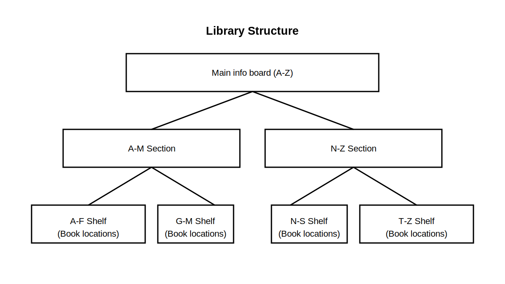
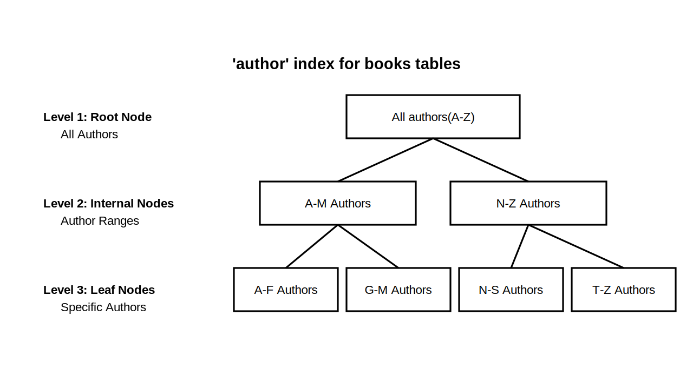
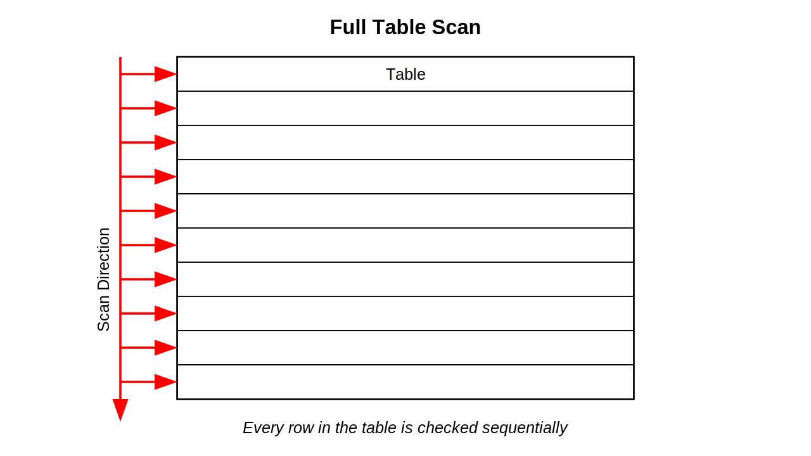
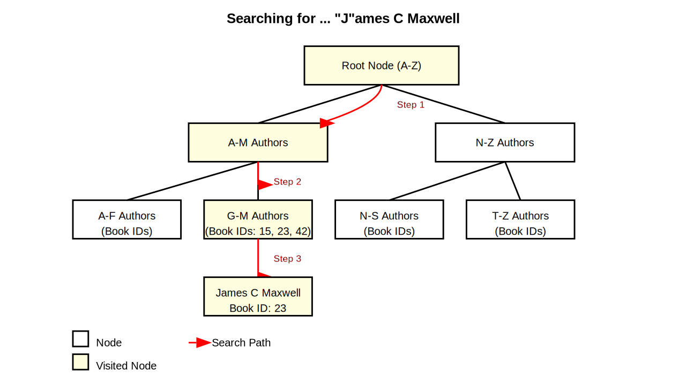

# インデックスの基本構造と動作

本記事では DB のインデックスについて、基本的な構造と動作を解説する。

普段なんとなく使うインデックスがどのように振る舞うかの参考として頂きたい。

## インデックスとは

インデックスは「**検索を高速化するためのデータ構造**」である。

本の索引(インデックス)を用いれば、特定単語を含んだページを素早く見つけられる。これと似た原理である。

## インデックスの基本的な概念

DB管理システムは、インデックス実装として主に「Bツリー」というデータ構造を利用する。

その他構造もあるが、まず「Bツリー」と考えて問題ない。

図書館で本を探す場合を例に取ってみる。

| 探索段階 | 目標                   | 探索物                                                                                              |
| -------- | ---------------------- | --------------------------------------------------------------------------------------------------- |
| 一回目   | 入口にある案内板 | 著者の頭文字(A-Z)<br />おおよその本棚エリアを把握                                                   |
| 二回目   | 各エリア | 各本棚エリアに示された、著者の頭文字(A-M, N-Z で区切られている)<br />目的の本棚があありそうなエリアに行く
| 三回目   | 目的の本棚 | 細分化された、著者の頭文字(A-F, G-M, N-S, T-Z で区切られている)<br />著者名を基に、目的の本棚を探す |

下図のように、木の構造をとる。この構造を応用したのが、DBのインデックスである。



## インデックスの基本構造

本を探索する例より、下のテーブルを用いてインデックス構造を理解していく。

```sql
CREATE TABLE books (
  id INT PRIMARY KEY,
  title VARCHAR(100),
  author VARCHAR(50)
);
```

著者名 `author` に対してインデックスが構成されている(Bツリーが実装されている)とする。

下図のように「上から下」へ効率的に探索しやすくなる。


| 段階                     | 網羅範囲                                                                           |
| ------------------------ | ---------------------------------------------------------------------------------- |
| 上段<br />(ルートノード) | `author` 全体(A-Z)                                                                 |
| 中段<br />(内部ノード)   | `author` の大まかな区分(A-M, N-Z)                                            |
| 下段<br />(リーフノード) | `author` の詳細(A-F, G-M, N-S, T-Z) |



## インデックスの探索挙動

実際に「インデックスなし」「インデックスあり」で探索挙動がどう変わるかを

先ほどの本を探す例から考えてみる。

### インデックスなしの場合

DB はテーブル全体をスキャンする(テーブル内の `author` 列を一つ一つ確認する)

図書館の例では、本探索の為に本棚全てを一つ一つ確認することと同じである。

一番最初に見つかれば運が良いが、一番最後に見つかれば運が悪い(非常に効率が悪い)



### インデックスありの場合

最初に「案内板(上段: ルートノード)」にアクセス

**Step 1**

目的の著者「`'James C Maxwell'` - 頭文字 **J**」を探索する為、

左の「'A-M' セクション(中段: 内部ノード)」へ移動

**Step 2**

「'A-M' セクション(中段: 内部ノード)」から、該当の本棚(下段: リーフノード)に移動

**Step 3**

本棚(下段: リーフノード)から目的の「`'James C Maxwell'` - 頭文字 **J**」を見つける

以上より、DB は数回の経路を辿るだけで良い。



## インデックスに関する注意点

ここまで見た通り、インデックスはDB内部にツリー構造を構築する必要がある。従って、

**インデックスの追加・更新・削除時には、その再構築に時間がかかる場合がある。**

データ量が多いテーブルには特に発生しやすい。実際どれぐらい影響するかは、

本番環境のバックアップ(リストアデータ)へ試してみると良い。

# 復習ポイント

ここまでの内容を要所ごとにリスト化する

* インデックスの基本概念
  * 本の索引と同様、データベースの検索を高速化する仕組み
  * 大量データから特定情報を素早く検索可能にする
* Bツリー構造
  * Bツリー構造に従って、効率的にデータ検索が可能
  * インデックスはこの構造を応用したもの
* インデックスの動作
  * ルートノードから始まり、内部ノードを経てリーフノードに到達
  * 全件走査せずに目的のデータにアクセス可能
* インデックスの注意点
  * インデックスの作成・更新にはコストがかかる
  * データの変更時はインデックスも更新が必要
