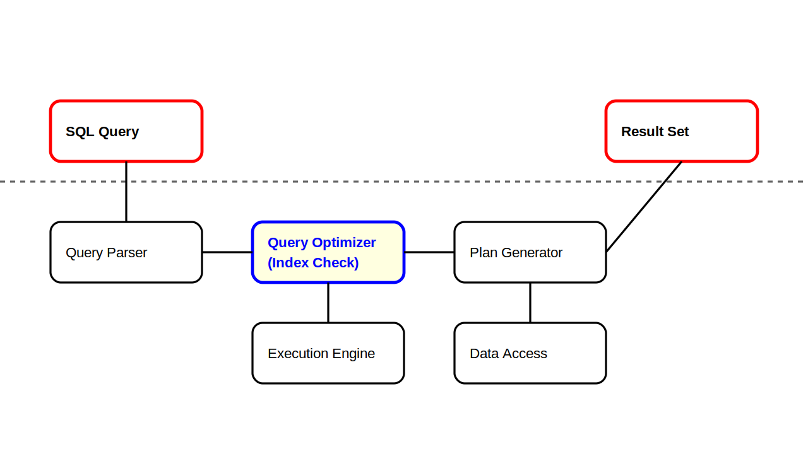

# 実行計画の読み方

この記事はインデックスの基本理解を前提としている為、**[インデックスの概念](../03_index_structure/README.md)** を先に読むことを推奨する。

## 実行計画とは

DB管理システムが「SQLクエリをどのように実行するか」を示すクエリスキャン情報である。

例えば次のようなクエリがある時

```sql
SELECT * FROM users WHERE status = 'active';
```

これが「適切にインデックスを使えているかどうか」は、クエリのみでは判断できない。

「実行計画」からクエリスキャン情報を得る必要がある。



この記事では「**フルテーブルスキャン・シーケンシャルスキャン**」「**ソートスキャン**」

二つのスキャン結果を軸に、その読み方の例を示す。

## 実行計画のやり方

`explain {目的の sql}` で実行可能。

```sql
explain SELECT * FROM users WHERE id = 1;
```

実行計画を行っても、データ取得・変更は行われない。

あくまで「クエリのスキャン」であり、実際にデータを取得・変更することはない。

---

以降の説明セクションは、次のサンプルテーブルにデータが 10万行ある場合を例に使う。

```sql
CREATE TABLE users (
  -- PostgreSQL
  id SERIAL PRIMARY KEY,
  -- MySQL
  id INT AUTO_INCREMENT PRIMARY KEY,

  status VARCHAR(20),
  created_at TIMESTAMP
);
```

## 1. フルテーブルスキャン / シーケンシャルスキャン

```sql
SELECT * FROM users WHERE status = 'active';
```

上の SQL を発行する時に、テーブルが次の状態であると仮定する。

* インデックスを貼れていない
* インデックスを貼っているが、効果を発揮できていない

この時、DB 内部では次の現象が起きる。

* **フルテーブルスキャン**: テーブル全体を一つ一つ読み取る
* **シーケンシャルスキャン**: フルテーブルスキャンと同様だが、目的データが見つかれば検索をやめる

これらの現象が起きているか「実行計画」で確認する。

### PostgreSQL の実行計画

```
explain SELECT * FROM users WHERE status = 'active';

                         QUERY PLAN
-------------------------------------------------------------
 Seq Scan on users  (cost=0.00..2414.00 rows=33557 width=61)
   Filter: ((status)::text = 'active'::text)
```

出力結果に **`Seq Scan`** がある為、目的のSQLは「シーケンシャルスキャン」の発生が予測される。

補足:

PostgreSQL の実行計画は、クエリ計画の実行予定順(ツリー状)に表示される

```
A
A の補足
  -> B
     B の補足
     -> C
        C の補足
```

これは C, B, A の順に実行されるスキャン結果だ、という表示である。


### MySQL の実行計画

```
explain SELECT * FROM users WHERE status = 'active' \G;

*************************** 1. row ***************************
           id: 1
  select_type: SIMPLE
        table: users
   partitions: NULL
         type: ALL
possible_keys: NULL
          key: NULL
      key_len: NULL
          ref: NULL
         rows: 99766
     filtered: 10.00
        Extra: Using where
```

補足: 末尾に `\G` をつけている。以降同じ出力をする。

* key(利用するキー) が NULL
  * インデックスキーが使われない
* type(読込タイプ) が ALL
  * フルテーブルスキャンを意味する

結果から、目的のSQLは「インデックスを使わない、フルテーブルスキャンの発生」が予測される。

### 主な対策

適切なインデックス付与で解決することが多い(参考: [スロークエリ対策](../05_plan_slow_query/README.md))

```sql
CREATE INDEX idx_users_status ON users(status);
```

### PostgreSQL の実行計画(対策後)

```sql
                                     QUERY PLAN
-------------------------------------------------------------------------------------
 Bitmap Heap Scan on users  (cost=380.36..1963.82 rows=33557 width=61)
   Recheck Cond: ((status)::text = 'active'::text)
   ->  Bitmap Index Scan on idx_users_status  (cost=0.00..371.97 rows=33557 width=0)
         Index Cond: ((status)::text = 'active'::text)
```

> Bitmap Index Scan on idx_users_status

より

「**`Bitmap Heap Scan`**(インデックスを利用したスキャン) が `idx_users_status` を使うこと」が予測される。

### MySQL の実行計画(対策後)

```sql
*************************** 1. row ***************************
           id: 1
  select_type: SIMPLE
        table: users
   partitions: NULL
         type: ref
possible_keys: idx_users_status
          key: idx_users_status
      key_len: 83
          ref: const
         rows: 49883
     filtered: 100.00
        Extra: NULL
```

* key(利用キー)に `idx_user_status` が表示される
  * インデックス利用予定
* type(読込種別) が ref
  * 非ユニークなインデックスを利用

より「インデックスを使った検索」が予測される。

## 2. ソートスキャン

通常、ソート時には全件スキャン(逐次的スキャン)が発生しうる。

テーブルが大量データを保持している場合に、非効率な検索となりやすい。

### スキャンする SQL の例

```sql
SELECT * FROM users ORDER BY created_at DESC LIMIT 100;
```

created_at にはインデックスを貼っていないものとする。

### PostgreSQL の実行計画例

```
explain SELECT * FROM users ORDER BY created_at DESC LIMIT 100;

                                        QUERY PLAN
----------------------------------------------------------------------------------------
 Limit  (cost=5000.46..5011.96 rows=100 width=61)
   ->  Gather Merge  (cost=5000.46..11765.22 rows=58824 width=61)
         Workers Planned: 1
         ->  Sort  (cost=4000.45..4147.51 rows=58824 width=61)
               Sort Key: created_at
               ->  Parallel Seq Scan on users  (cost=0.00..1752.24 rows=58824 width=61)

```

* (下段) `Prallel Seq Scan` より、並列シーケンシャルスキャンを行う
* (中段) のち、`Sort` よりソートを行う
* (上段) 最後に、`Gather Merge` から結果を結合する
* (最上段) `Limit` で制限

シーケンシャルスキャンの派生があり、まだ改善の余地があるだろうと予測される。

### MySQL の実行計画例

```
*************************** 1. row ***************************
           id: 1
  select_type: SIMPLE
        table: users
   partitions: NULL
         type: ALL
possible_keys: NULL
          key: NULL
      key_len: NULL
          ref: NULL
         rows: 99766
     filtered: 100.00
        Extra: Using filesort
```

* type(読込種別) が ALL
* key(利用キー) が NULL
  * フルテーブルスキャンを示す
* Extra(特記)には `Using filesort`
  * 検索条件にインデックスが使われてないことを示す

フルテーブルスキャンの結果とほぼ変わりはないと予測される。

### 主な対策

* sort 対象の属性にインデックスを作成
* (未対策の場合) LIMIT を使用して返される行数を制限

```sql
-- sort 対象の属性にインデックスを作成
CREATE INDEX idx_users_created_at ON users(created_at);

-- (未対策の場合) LIMITを使用して返される行数を制限
SELECT * FROM users ORDER BY created_at DESC LIMIT 3;
```

### PostgreSQL の実行計画(対策後)

```sql
explain SELECT * FROM users ORDER BY created_at DESC LIMIT 100;

                                           QUERY PLAN
-------------------------------------------------------------------------------------------------
 Limit  (cost=0.29..7.55 rows=100 width=61)
   ->  Index Scan using idx_users_created_at on users  (cost=0.29..7260.17 rows=100000 width=61)
-------------------------------------------------------------------------------------------------
```

`idx_users_created_at` が使われ、効率的検索になると予測される。

### MySQL の実行計画(対策後)

```sql
explain SELECT * FROM users ORDER BY created_at DESC LIMIT 100;

*************************** 1. row ***************************
           id: 1
  select_type: SIMPLE
        table: users
   partitions: NULL
         type: index
possible_keys: NULL
          key: idx_users_created_at
      key_len: 5
          ref: NULL
         rows: 100
     filtered: 100.00
        Extra: Backward index scan
```

* key(利用キー)が `idx_users_created_at`
* type が index(インデックススキャン)

であり、効果的検索が予測される。

## 総括

以上二つの例より、実行計画の結果からクエリの挙動予測が可能である。

あくまで基本的な読み方である為、その他詳しい読み方は公式ドキュメントを参考にしていただきたい。

また、応用的になる為「ネステッドループ」「ハッシュ結合」「マージ結合」のスキャン結果と対策を意図的に外した。

# プロジェクト実践リスト

ここまでを踏まえた、実プロジェクトでの活用を目的としたリストである。

活用の参考として頂きたい。

```
# 実行計画の取得と基本分析
- [ ] EXPLAIN コマンドによる実行計画の取得
- [ ] 実行計画の各ステップを順次確認
- [ ] コストが高い操作の特定

# テーブルスキャンの最適化
- [ ] フルテーブルスキャン発生箇所の確認
- [ ] 頻発 WHERE 句条件へのインデックス作成
- [ ] 複合インデックス必要性を確認

# ソート操作の最適化
- [ ] 大規模ソート操作箇所の特定
- [ ] ソート使用カラムへのインデックス作成
- [ ] ORDER BY と LIMIT の併用によるソートデータ量制限

# インデックス本番適用前の確認
- [ ] 本番と近しいデータセットで影響範囲の確認(適用時間など)
- [ ] 場合によってはメンテナンスページへの切替を考慮
```

## 次のステップ

* ローカル環境で適当なクエリーに対して実行計画を確認し、読み方に慣れる
* 本番環境で、実行計画を確認する
  * 特に、データ量が多いテーブルで試しローカルと違いがあるかを確認する
* 主要テーブルより、フルテーブルスキャンのクエリーをインデックススキャンにする
  * スロークエリを見つける
  * 実行計画を確認する
  * 必要な対策案を考える
