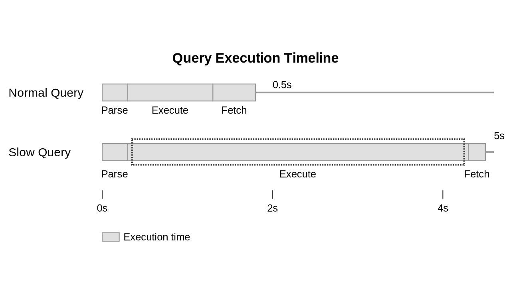

# スロークエリ対策

この記事はインデックスの基本理解を前提としている為、**[インデックスの概念](../03_index_structure/README.md)** を先に読むことを推奨する。

## スロークエリの定義

スロークエリとは、**実行に長時間を要するSQLクエリ** のことである。「長時間」の定義は要件によって異なる。

Web システムの場合は **1 秒超えならばスロークエリ** が目安である。

なぜならば、全体レスポンスタイムが 1 秒以上であるのは UX 指標に影響するからだ。



## スロークエリログの有効化

スロークエリログを有効化することで、ログからクエリ分析可能になる。次は設定の例である。

コンテナ環境等では、他に設定が必要なことがあるので留意する。

```sql
-- PostgreSQL
-- postgresql.conf
log_min_duration_statement = 2000
log_directory = 'pg_log'

-- MySQL
-- my.cnf
[mysqld]
slow_query_log=1
slow_query_log_file=/var/log/mysql/slow.log
long_query_time=2
```

## スロークエリ対策の流れ

大まかに次の流れを取る。

1. スロークエリログより、クエリを確認し一覧化
2. クエリを [実行計画](../04_analyze_exec_plan/README.md) で解析
3. 後述する「インデックス対策」「インデックスが効果的に適用されない場合」から対策を考慮

## 基本的なインデックス対策

主に 4 つを把握しておきたい。

1. WHERE で使用される属性にインデックスを作成
2. 複合インデックスの順序は WHERE の順序に合わせる
3. 頻繁に使用される JOIN 条件にインデックスを作成

### 1. WHERE で使用される属性にインデックスを作成

WHERE 属性にインデックスが無いと、フルテーブルスキャンが発生する(テーブル内データ全てを逐次的に読み込む)

効率的な検索の為に WHERE の属性にインデックスを作成する。

```sql
-- SQL の例
SELECT * FROM users WHERE email = 'example@example.com';

-- インデックス作成の例
CREATE INDEX idx_users_email ON users(email);
```

### 2. 複合インデックスの順序は WHERE の順序に合わせる

DB エンジンは「複合インデックスを左端の列から順に評価」する。

従って WHERE 句をインデックスの順序に合わせることで、検索効率を高くすることができる。

```sql
-- SQL の例
SELECT * FROM users WHERE last_name = 'Smith' AND first_name = 'John';

-- インデックス作成の例
CREATE INDEX idx_users_lastname_firstname ON users(last_name, first_name);
```

### 3. 頻繁に使用される JOIN 条件にインデックスを作成

**JOIN はDB内部で結合処理を行う** ため計算コストが高い。

従って、関連カラムにインデックスを作成することで、効率的にデータ結合できるようになる。

```sql
-- SQL の例
SELECT
  p.title,
  u.name,
  c.content
FROM
  posts p
INNER JOIN users u ON p.user_id = u.id
INNER JOIN comments c ON p.id = c.post_id
WHERE p.created_at >= '2024-02-01';

-- インデックスの作成例
CREATE INDEX idx_posts_created_user ON posts(created_at, user_id);
CREATE INDEX idx_comments_post_user ON comments(post_id, user_id);
```

**`CREATE INDEX idx_posts_created_user ON posts(created_at, user_id);`**

「特定期間の特定ユーザー」posts の検索を高速化する。

| 目的の SQL                                                                         | 高速化の目的                  |
| ---------------------------------------------------------------------------------- | ----------------------------- |
| `WHERE p.created_at >= '2024-02-01'`                                               | 期間の絞込                    |
| `WHERE p.created_at >= '2024-02-01'`<br />`INNER JOIN users u ON p.user_id = u.id` | posts と users の JOIN 高速化 |

**`CREATE INDEX idx_comments_post_user ON comments(post_id, user_id);`**

| 目的の SQL                                  | 高速化の目的                     |
| ------------------------------------------- | -------------------------------- |
| `INNER JOIN comments c ON p.id = c.post_id` | posts と comments の JOIN 高速化 |

## インデックスが効率的に適用されない場合

特定状況下では注意が必要である。次の 5 ケースは押さえておきたい。

1. `WHERE` 句で関数や演算を使用
2. `NULL` を含む可能性のあるカラムで`IS NULL`や`IS NOT NULL`を使用
3. インデックス列に対して暗黙の型変換を行う
4. `LIKE`検索で前方一致以外を使用
5. `OR` を利用

### 1. `WHERE` 句で関数や演算を使用

```sql
SELECT * FROM users WHERE YEAR(created_at) = 2023;
```

関数や演算は、インデックスに保存されている値との直接比較ができず、フルテーブルスキャンの可能性を生む。

### 2. `NULL` を含む可能性のあるカラムで `IS NULL` や `IS NOT NULL` を使用

```sql
SELECT * FROM users WHERE last_login_date IS NULL;
```

NULL はインデックスに特別な方法で保存される為、インデックスが効率的に使用されない場合がある。

### 3. インデックス列に対して暗黙の型変換を行う

```sql
SELECT * FROM users WHERE id = '1000';  -- id が INTEGER 型の場合
```

DBエンジンは各行に対して型変換を行う必要があり、インデックスを効率的に使用できない。

### 4. `LIKE`検索で前方一致以外を使用

```sql
SELECT * FROM products WHERE name LIKE '%phone%';
```

後方一致、全文検索(`'%val'`, `'%val%'`)は、インデックス順序を活用できずフルテーブルスキャンが発生する。

前方一致はこの限りではない。

### 5. `OR` を利用

```sql
SELECT * FROM users WHERE email = 'example@example.com' OR username = 'example_user';
```

OR 検索では、インデックスマージかフルテーブルスキャンが必要になる。

## インデックス追加および削除時の留意事項

インデックスの追加・削除中は、テーブルに対してロックがかかる可能性がある。

大規模テーブルの場合は完了までに長時間かかり、信頼性低下につながる恐れがある。

必ず本番と近しいデータセットを用いてテストし、影響範囲の確認・適用完了までの時間を計測すること。

# プロジェクト実践リスト

ここまでを踏まえた、実プロジェクトでの活用を目的としたリストである。

活用の参考として頂きたい。

```
# 現状分析
* [ ] スロークエリログの有効化
* [ ] 頻発スロークエリのリストアップ
* [ ] 各スロークエリの実行計画確認

# インデックス最適化
* [ ] WHERE句頻出列へのインデックス作成
* [ ] 複合インデックス順序とWHERE句順序の一致確認
* [ ] 頻出JOIN条件列へのインデックス作成

# クエリ最適化
* [ ] WHERE句での関数・演算使用クエリの確認
* [ ] IS NULL/IS NOT NULL使用クエリのパフォーマンス確認
* [ ] インデックス列での暗黙的型変換の有無確認
* [ ] 前方一致以外のLIKE検索クエリの最適化
* [ ] OR条件使用クエリのパフォーマンス確認
* [ ] 小規模テーブルへのクエリパフォーマンス確認

# パフォーマンスモニタリング
* [ ] クエリレスポンスタイムの定期測定
* [ ] システムリソース（CPU、メモリ、ディスクI/O）使用状況の監視
* [ ] DBサーバー負荷状況の定期確認
* [ ] アプリケーションレベルパフォーマンス指標の監視

# インデックス変更時の計画
* [ ] インデックス追加・削除作業の影響範囲事前評価
* [ ] 大規模テーブルへのインデックス変更の段階的実施計画
* [ ] インデックス変更前の DB バックアップ取得
* [ ] インデックス変更中のシステムリソース・パフォーマンス監視計画策定
* [ ] インデックス変更後のアプリケーション動作・パフォーマンステスト計画策定

# 定期的な見直し
* [ ] DB パフォーマンスの月次/四半期レビュー実施
* [ ] 新規/変更クエリパターンを考慮したインデックス戦略見直し
* [ ] DB バージョンアップグレードに伴う最適化機会の検討
```

# 次のステップ

* スロークエリログを有効化する
* ログを確認し、問題のクエリーを一覧化する
* 簡易的に済ませられそうなスロークエリに目星をつける
  * WHERE 句の条件が一つだけ、など
* インデックス対策をし、テストを行う
