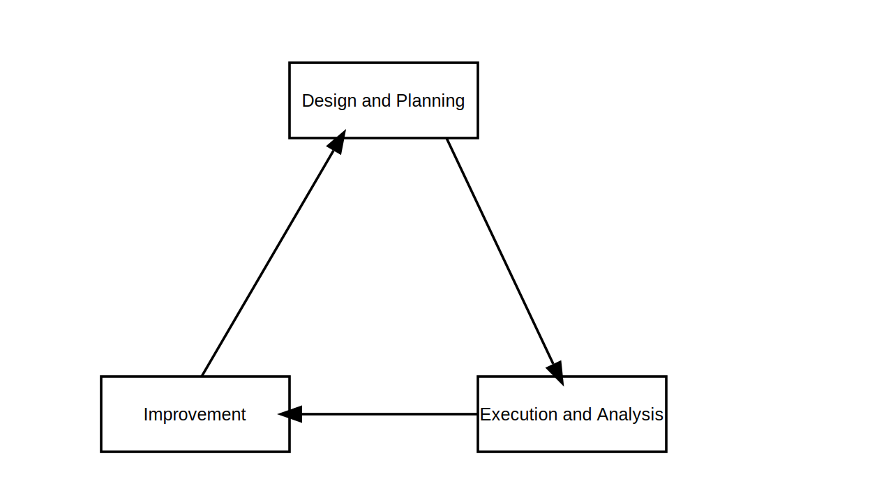

# 負荷テスト概論

負荷テストは、Webシステムの **信用性と安定性を評価** するプロセスである。

対応を怠ると、次のような信用性低下・安定性低下を発生させうる。

| 現象                       | 副作用               |
| -------------------------- | -------------------- |
| 予期せぬシステムダウン     | ビジネス機会損失     |
| ユーザー体験の悪化         | 顧客離れ             |
| 突発的なパフォーマンス低下 | ブランドイメージ低下 |
| 拡張性低下                 | 事業拡大の阻害       |

本記事では「負荷テストをどのような流れで取るべきか」を中心に解説する。

具体的なツールは用いず、方法論のみにとどめていることを了承願いたい。

**注意:**

負荷テストの中でも「限界テスト **(*1)**」に焦点を当てて解説する。

スパイクテスト, ロングランテストなどその他手法でも、応用は可能である。

**(*1)**: 限界テストとは

負荷テスト手法の一つで、システムのパフォーマンス限界点を把握する手法のこと。

その限界点前は安定的であり、超過すれば応答不可等の状態になる。

## 負荷テスト全体の流れ

次の流れで進める。

* (1) **計画と設計**
  * テスト計画の策定
  * テストシナリオの設計
  * テスト環境の準備
* (2) **テスト実行**
* (3) **途中分析と調整**
  * 指標分析とボトルネック特定
  * 再テストと負荷増加
  * 限界値の特定
* (4) **最終結果の分析と改善**

(2)のテスト実行前後がテストのポイントである。以降で解説する。

* (1) **計画と設計**: 実際のユースケースを模倣したシナリオを作成
* (3) **途中分析と調整**: パフォーマンス指標を分析し、問題箇所を特定
* (4) **最終分析と改善**: テスト結果をまとめ、今後の改善策を決定



## (1) 計画と設計

テストシナリオをより効果的なものにする為、**現実のユーザー行動をシナリオに反映させる**。

具体的には次の対応が必要。

1. **ユーザーの行動ログトレース**: アクセスログを分析し、一般的なユーザーパスを特定
2. **正常系・異常系の両方を網羅**: 「ユーザーの意図するもの、しないもの」両方のケースを考える

**具体的なシナリオ例**

ECサイトを例にすると、次のようなシナリオ設計をする

負荷割合は、実際のアクセスログ分析に基づいて決定したとする。

| シナリオ種別 | ユーザーパス                             | シナリオに対する負荷割合 | 備考                              |
| ------------ | ---------------------------------------- | ------------------------ | --------------------------------- |
| 正常系       | トップページを閲覧                       | 40%                      |                                   |
| 正常系       | 商品検索を実行                           | 25%                      |                                   |
| 正常系       | 商品詳細ページを閲覧                     | 15%                      |                                   |
| 正常系       | カートに商品を追加                       | 8%                       |                                   |
| 正常系       | 注文を完了                               | 2%                       |                                   |
| 異常系       | 存在しない商品IDにアクセス               | 3%                       | ユーザーの意図しない行動          |
| 異常系       | 大量の商品を一度にカートに追加           | 1%                       | ボットによる攻撃を想定            |
| 異常系       | 検索に特殊文字や長い文字列を使用         | 2%                       | SQLインジェクション攻撃などを想定 |
| 異常系       | 同一アカウントで複数デバイスからログイン | 1%                       | セッション管理の検証              |
| 異常系       | 決済処理中にブラウザを閉じる             | 3%                       | トランザクション処理の検証        |


## (3) 途中分析と調整

アプリケーションテストの「バグ数」「影響範囲」と同じく、負荷テスト後に「指標」を揃える。

最低限、表にある通り 5 つは揃えたい。指標を基に以下を判断・調査をしていく

* 負荷量の調整(目標数値以内か)
* テスト環境自体に問題ないか(各指標が少しの負荷で閾値超えしていないか)
* etc.

| 指標名           | 意味                         | 一般的な目標数値                       |
| ---------------- | ---------------------------- | -------------------------------------- |
| レスポンスタイム | ユーザーリクエストの応答時間 | Webシステム: 2秒以内<br>API: 200ms以内 |
| スループット     | 単位時間あたりの処理件数     | 想定ピーク時の120%以上                 |
| エラー率         | 失敗したリクエストの割合     | 1%未満(理想は0.1%未満)                 |
| CPU 使用率       | DB サーバーの CPU 使用状況   | 平均50%以下、ピーク時80%以下           |
| メモリ使用率     | DB サーバーのメモリ使用状況  | 使用可能メモリの80%以下                |

**注意:**

目標数値はシステム要件により変動する。あくまで参考値としていただきたい。

## (4) 最終分析と改善

負荷テストは継続性が必要である。本番環境は常に変化し、限界点も変わるからである。

従って「最終分析を次に活かせる状態」にしておく。以下情報を残すことが望ましい

| 記録情報             | 補足                                                           |
| -------------------- | -------------------------------------------------------------- |
| データの可視化       | 各指標をグラフ・チャート等で可視化したもの                     |
| 特定したボトルネック | パフォーマンス低下箇所とその原因                               |
| 綜合的な台帳記録     | 問題の影響範囲、改修用意さ、改善策(暫定案・恒久案)、優先度など |

## 負荷テストによくある事例と解決策

### 事例1. テストデータ作成の為、多大な工数が必要

本番データの写しを洗浄(クレンジング)し、再利用する。例えば以下のような洗浄をする。

| データ         | 洗浄方法                                    | 目的                     |
| -------------- | ------------------------------------------- | ------------------------ |
| メールアドレス | ホストをすべて `example.com` へ             | テスト中の誤送信を防ぐ   |
| 通知系のフラグ | 全て OFF, もしくは OFF に等しいデータへ変更 | テスト中の通知をさせない |
| 名前           | 無作為な文字列へ                            | 個人情報の破棄           |

### 事例2. DB ではなくアプリケーション側のボトルネック特定が困難である、特定作業に工数が必要

APM(アプリケーションパフォーマンス監視)ツールを導入し、詳細分析できるようにする。

### 事例3. テストを実施し始めるとシステムクラッシュする

急激に負荷を上げない。段階的に負荷を緩やかに上げていく

### 事例4. 負荷テスト結果を活用しきれていない

以下三つを参考にする

* テスト合格基準(ベースライン)と比較する
* 過去のテスト結果と比較する
* ビジネス指標と関連付ける
  * 向こう一年先のユーザー増加量に耐久できるか
  * 需要予測に基づいて、リクエスト量が増えても問題ないか

## プロジェクト用の実践リスト

ここまでを踏まえた、実プロジェクトでの活用を目的としたリストである。

活用の参考として頂きたい。

```
# テスト計画の策定
* [ ] 目的と範囲を明確に定義
* [ ] 成功基準の設定 (各パフォーマンス指標の目標値)
* [ ] スケジュール作成

# テスト環境の準備
* [ ] 本番環境に近いテスト環境のセットアップ
* [ ] 本番環境に近いデータセットの準備
* [ ] 必要なツールのインストールと設定

# テストシナリオの設計
* [ ] テスト種別の選定
* [ ] アクセスログからユーザーの行動トレース
* [ ] トレース結果から、主要なユースケースの特定
* [ ] エラーケースのシナリオ設計(正常系と異常系)

# 初期負荷テストの実行
* [ ] テスト環境自体に問題がないか、テストのテストを実施

# テスト環境調整
* [ ] 改善策の立案
* [ ] 改善策の優先順位付け

# 本テスト実施
* [ ] 調整後のテスト環境でテストを実施
* [ ] 各パフォーマンス指標を記録

# 最終結果の分析とレポート作成
* [ ] テスト結果の総合分析
* [ ] 問題点・改善事項を整理
* [ ] 必要があれば再テスト
```

## 次のステップ

* Apache JMeter や Gatling などのオープンソース負荷テストツールを、ローカルで動作させる
* 記事にある「計画と設計」およびテスト実行を 一機能分、実際に行う
