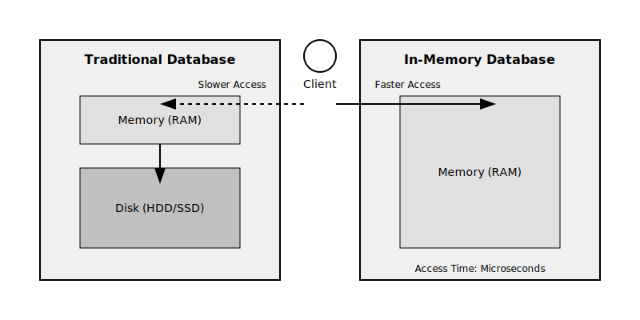
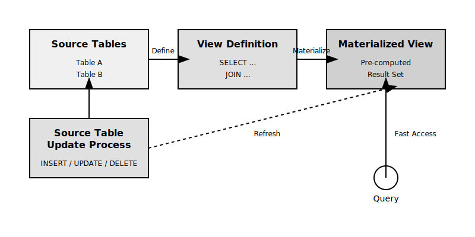
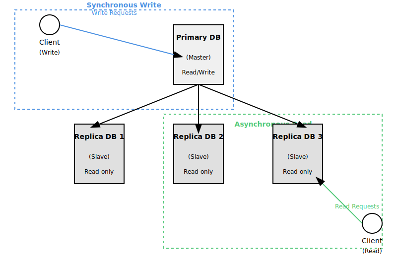
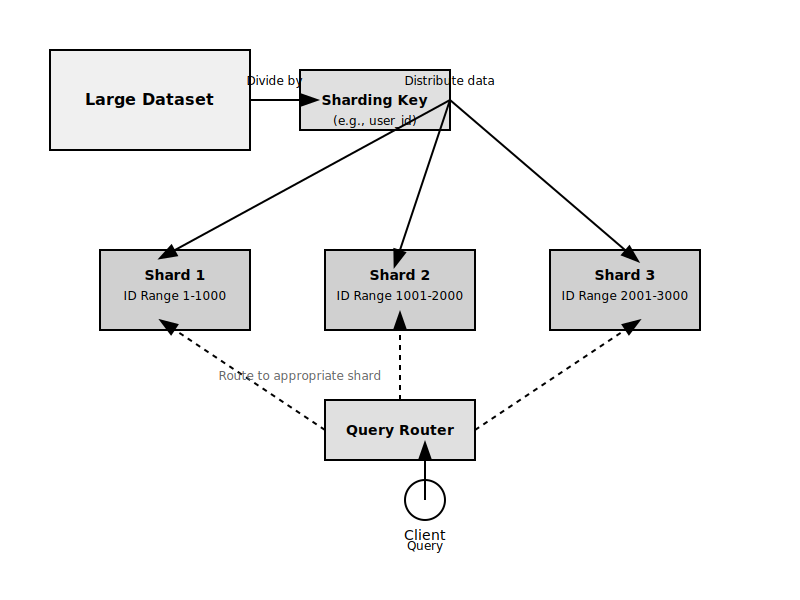

# 応用編 - DB関連のアーキテクト変更

本記事では「データ検索の更なる高速化」を目的とした、DBアーキテクト変更案を記載する。

内容は応用的なので、以下の三つ

* N+1対策
* スロークエリ対策
* 負荷テスト

を定期的に実施した上で「これ以上の改善は見込めない」場合の参考として頂きたい。

また、詳細には踏み込まず「紹介程度」にとどめている。

| 方式                   | より高難度か | 手法                         | 採用基準                               | リスク                     |
| ---------------------- | ------------ | ---------------------------- | -------------------------------------- | -------------------------- |
| インメモリデータベース | -            | データのメモリ保持           | 高速な読取と書込が必要な時             | メモリコストと永続性       |
| マテリアライズドビュー | -            | 複雑クエリ結果の事前計算     | 同一の複雑クエリが頻繁に実行される時   | 更新コストと鮮度の管理     |
| レプリケーション       | -            | データのコピー作成と読取分散 | 読取操作の増加時                       | データの一貫性維持が難     |
| シャーディング         | x            | データの水平分割とDB分散     | データ量が急増し、単一DBで対応困難な時 | アプリケーション層の複雑化 |

## インメモリデータベース

データを RAM 上に保持することで、高速データアクセスを実現する方法である。

ディスクI/Oを抑えられる為、DB に比べパフォーマンス向上が見込める。

| 特徴             | ポイント                                             | 留意点                                 |
| ---------------- | ---------------------------------------------------- | -------------------------------------- |
| 高速性           | ディスクアクセスを排除し、メモリ上でデータ操作を行う | メモリコストが高い                     |
| 揮発性           | 電源断でデータが消失するリスク                       | バックアップ戦略が重要                 |
| 拡張性           | 分散システムでのスケールアウトが一般的               | メモリ容量の制約がある                 |
| リアルタイム処理 | 即時的なデータアクセスと更新が可能                   | 既存アプリケーションには設計変更が必要 |

## マテリアライズドビュー

複雑なクエリ結果を事前に計算し、物理的に保存しておく手法である。

「頻繁に実行される複雑なクエリ」に対してはパフォーマンス向上が見込まれる。

| 特徴               | ポイント                         | 留意点                             |
| ------------------ | -------------------------------- | ---------------------------------- |
| パフォーマンス向上 | 複雑なクエリ結果を事前計算       | 追加ストレージが必要な場合あり     |
| リフレッシュ機能   | 定期的または即時に更新可能       | 更新頻度の設計・設定が重要         |
| クエリ最適化       | DB内部にて自動的なクエリ書き換え | 適切なビュー設計が必要             |
| 柔軟性             | 複雑な集計や結合のサポート       | メンテナンスコストが増加する可能性 |

## レプリケーション

データを複数のサーバーに複製し、読み取り操作を分散させる手法である。

読取の拡張性・稼働能力を向上させることができる。

| 特徴                 | ポイント                     | 留意点                           |
| -------------------- | ---------------------------- | -------------------------------- |
| 読取の拡張性         | 複数のレプリカにて読取分散   | 書込スケーラビリティは向上しない |
| 稼働能力の向上       | サーバー障害時の継続性確保   | フェイルオーバー設定が必要       |
| レプリケーション方式 | 同期・非同期など複数の選択肢 | トレードオフを考慮した選択が重要 |

## シャーディング

大規模なデータセットを複数のDBサーバー(シャード)に水平分割する手法である。

データとクエリ負荷を分散させ、大規模なスケールアウトが可能になる。

テーブル分割作業も踏まえるため、他の手法と比較して難易度は高めである。

| 特徴               | ポイント                             | 留意点                       |
| ------------------ | ------------------------------------ | ---------------------------- |
| 高い拡張性         | 理論上は無限にスケールアウト可能     | アプリケーション層の複雑化   |
| 柔軟な拡張性       | 需要に応じたシャードの追加が可能     | データの再バランシングが必要 |
| データ分散         | シャーディングキーによる効率的な分割 | 適切なキー選択が重要         |
| テーブル分割の前提 | 大規模テーブルの論理的分割が必要     | テーブル設計の見直しが必須   |

## 総括

手法はそれぞれ特性や難度が異なるため、要件、制約、要求技術に応じて適切な方式を選択することが重要である。

# 全体復習

## インメモリデータベース
* **データをRAM上に保持し、超高速なデータアクセスを実現する手法**
* ディスクI/Oを最小限に抑える
* 揮発性のため、永続化の仕組みが必要
* メモリ容量の制約がある

## マテリアライズドビュー
* **複雑なクエリ結果を事前に計算し物理的に保存する手法**
* 頻繁に実行される複雑なクエリのパフォーマンスを向上
* 定期的または即時の更新(リフレッシュ)が必要
* クエリの最適化に活用可能
* 複雑な集計・結合にはメンテナスコストがかかる可能性あり

## レプリケーション
* **データを複数のサーバーに複製する手法**
* 読取操作の負荷分散が可能
* 同期または非同期で複製を行う
* データの一貫性維持が必要

## シャーディング
* **大規模なデータセットを複数のデータベースサーバー(シャード)に水平分割する手法**
* 理論上は無限にスケールアウト可能
* シャーディングキーに基づいてデータを分散
* 書き込み/読み取り操作の負荷分散が可能
* データの再バランシングやテーブル分割等が必要
